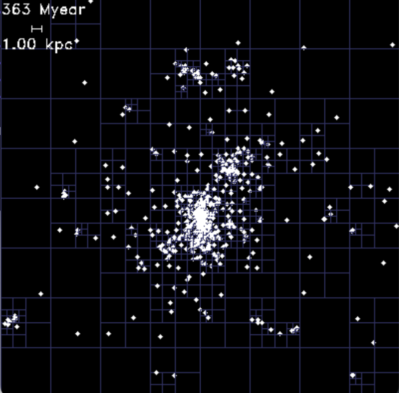
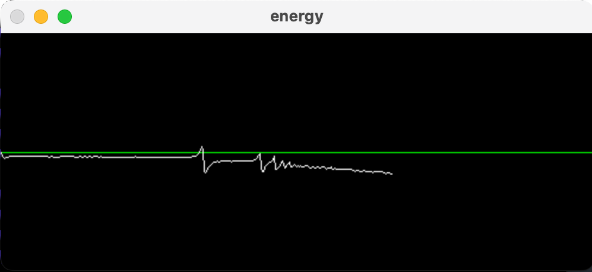

## Simulátor galaxií

### Základní informace

`galaxy` je jednoduchý *polofyzikální* n-částicový simulátor galaxií napsaný v C++.

### Funkce

- Orthtree a aproximované n-částicové simulace s pomocí algoritmu Barnes-Hut
- 2D a 3D simulace
- Nastavitelnost jednotek simulace
- Grafy zachování energie
- Dva vykreslovací backendy:
    - OpenCV
        - podporuje zapisování mp4 videa
    - Raylib
        - původní backend bylo OpenCV, nešlo mi ale rozběhnout na Windowsu, takže nakonec vznikl Raylibový backend
        - bohužel o něco pomalejší
- (Zatím) dvě základní integrační metody (eulerovská a leapfrog)
- Možnosti konfigurace počátečních podmínek simulace
- Konfigurační soubory v přehledném formátu TOML

### Použití
```sh
galaxy simulation.toml
```
kde `simulation.toml` je platný soubor s nastavením simulace. Ukázkové nastavení simulací naleznete ve složce [examples](../examples).

### Kompilace

#### macOS + Linux
```sh
mkdir build
cmake ../src
cmake --build .
./galaxy ../examples/basic.toml
```

#### Windows
Stačí pustit CMake přes VisualStudio a pak zbuilděný program spustit se správnými argumenty.

#### (Volitelné) OpenCV backend
Z důvodů kompatibility je defaultní backend Raylib. Pro přepnutí na OpenCV backend stačí v build složce spustit následující příkaz:
```sh
cmake -DUSE_OPENCV_GRAPHICS=YES .
```
Při příštím `cmake --build .` se program zbuildí s OpenCV backendem.

### Obrázky a videa



